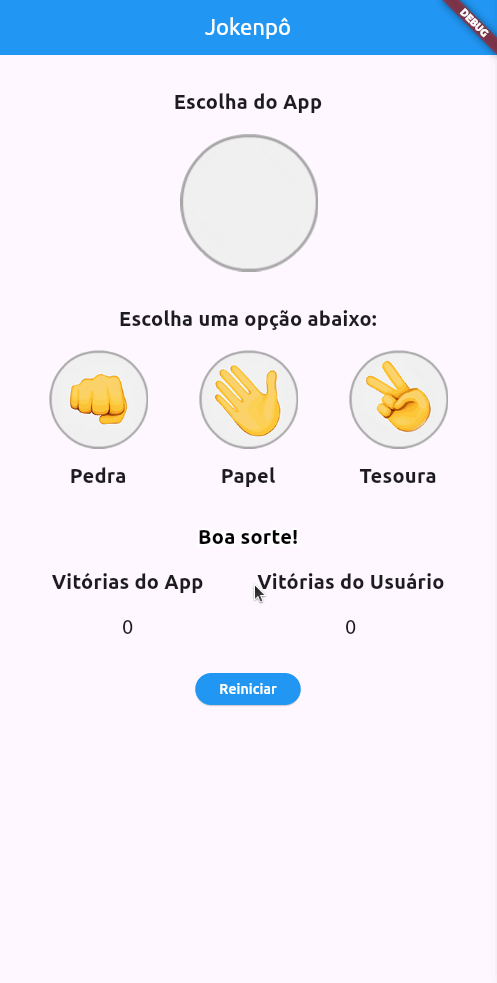
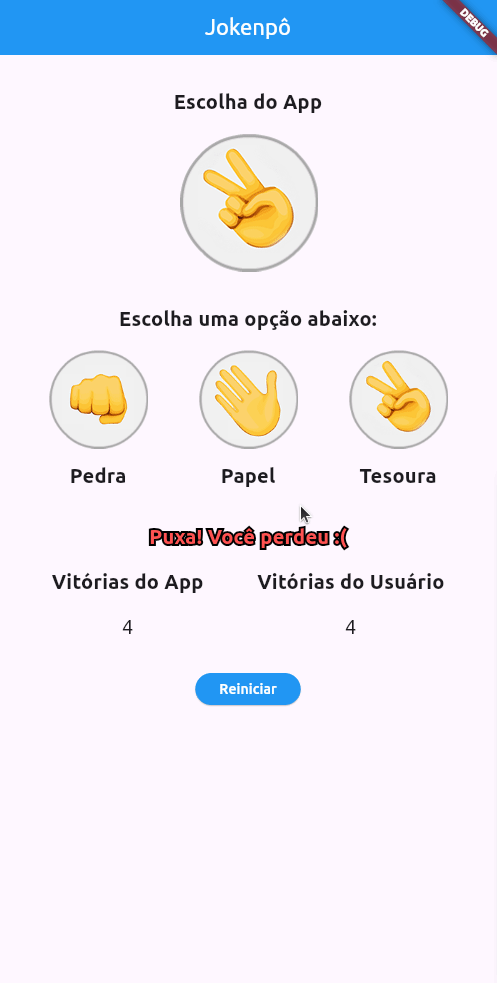

# Jokenpô on Flutter ✊📄✂️
🚀 Singleplayer Jokenpô game made with Flutter available in mobile, desktop and web devices!

## Features
♾️ Play infinite games with computer (singleplayer) and count your wins and loses.
<div style="width: 100%; display: flex; justify-content: center;">
  
</div>

🔄 Fast reset your gameplay within one click.
<div style="width: 100%; display: flex; justify-content: center;">
  
</div>

## Installation
As it is a Flutter application it doesn't need to install any dependency among Flutter itself.

So, firstly it's necessary to install Flutter on your development device to be able to start the project. You can do it on [official docs](https://docs.flutter.dev/get-started/install) (choose your operational system correctly).

When you complete Flutter installation following all the steps, now you are supposed to download the project. You can do it with:
```sh
$ git clone https://github.com/yandevv/jokenpoFlutterApp.git
```

## Usage
With project downloaded locally, now you can run it with:
```sh
$ flutter run
```

It will start the project up and you will be able to choose what device you want to run it.
